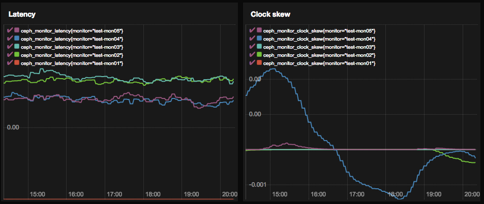

# Ceph Exporter  [](https://godoc.org/github.com/digitalocean/ceph_exporter) [](https://travis-ci.org/digitalocean/ceph_exporter) [](https://coveralls.io/github/digitalocean/ceph_exporter?branch=master) [](https://goreportcard.com/report/digitalocean/ceph_exporter)

A Prometheus exporter that scrapes meta information about a running Ceph
cluster. All the information gathered from the cluster is done by interacting
with the monitors using an appropriate wrapper over
`rados_mon_command()`. Hence, no additional setup is necessary other than
having a working Ceph cluster.

## Dependencies

You should ideally run this exporter from the client that can talk to the Ceph
cluster. Like any other Ceph client, it needs the following files to run
correctly.

* `ceph.conf` containing your Ceph configuration.
* `ceph.<user>.keyring` in order to authenticate to your Ceph cluster.

The `ceph_exporter` will automatically pick those up if they are present in
any of the [default
locations](http://docs.ceph.com/docs/master/rados/configuration/ceph-conf/#the-configuration-file). Otherwise
you will need to provide the configuration manually using environment
variables:

* `CEPH_CLUSTER`: cluster's name (default `ceph`)
* `CEPH_CONFIG`: configuration file that a Ceph client uses to connect to
  the cluster (default `/etc/ceph/ceph.conf`)
* `CEPH_USER`: a Ceph client user used to connect to the cluster (default
  `admin`)

We use Ceph's [official Golang client](https://github.com/ceph/go-ceph) to run
commands on the cluster.

This `ceph_exporter` branch is tested only on Ceph Nautilus releases. It might
not work as expected with older or non-LTS versions of Ceph.

## Environment Variables

Name | Description | Default
---- | ---- | ----
`TELEMETRY_ADDR` | Host:Port for ceph_exporter's metrics endpoint | `*:9128`
`TELEMETRY_PATH` | URL Path for surfacing metrics to Prometheus | `/metrics`
`EXPORTER_CONFIG` | Path to ceph_exporter configuration file | `/etc/ceph/exporter.yml`
`RGW_MODE` | Enable collection of stats from RGW (0:disabled 1:enabled 2:background) | `0`
`CEPH_CLUSTER` | Ceph cluster name | `ceph`
`CEPH_CONFIG` | Path to Ceph configuration file | `/etc/ceph/ceph.conf`
`CEPH_USER` | Ceph user to connect to cluster | `admin`
`CEPH_RADOS_OP_TIMEOUT` | Ceph rados_osd_op_timeout and rados_mon_op_timeout used to contact cluster (0s means no limit) | `30s`
`LOG_LEVEL` | logging level. One of: [trace, debug, info, warn, error, fatal, panic] | `info`

## Installation

Typical way of installing in Go should work.

```
$ go install
```

A Makefile is provided in case you find a need for it.

## Docker Image

### Docker Hub

The official docker image is available at
[digitalocean/ceph_exporter](https://hub.docker.com/r/digitalocean/ceph_exporter/).

### Build From Source

It is also possible to build your own locally from the source. The port `9128`
is exposed as a default port for `ceph_exporter`.

The exporter needs your Ceph configuration in order to establish communication
with the Ceph monitors. You can either pass it in as an additional command or
mount the directory containing both your `ceph.conf` and your user's keyring
under the default `/etc/ceph` location that Ceph checks for.

A sample build command would look like:

```bash
$ docker build -t digitalocean/ceph_exporter .
```

A `--build-args TEST=true` flag can be added to the build command above to
also run Golang's unit tests during build:

```bash
docker build -t digitalocean/ceph_exporter . --build-arg TEST=true --no-cache
```

You can start running your `ceph_exporter` container now.

```bash
$ docker run -v /etc/ceph:/etc/ceph -p=9128:9128 -it digitalocean/ceph_exporter
```

You would have to ensure your image can talk over to the monitors. If it needs
access to your host's network stack you might need to add `--net=host` to the
above command. It makes the port mapping redundant so the `-p` flag can be
removed.

Point your Prometheus to scrape from `:9128` on your host now (or your port
of choice if you decide to change it).

## Contributing

Please refer to the [CONTRIBUTING](CONTRIBUTING.md) guide for more
information on how to submit your changes to this repository.

## Sample view

See `./examples` for a `docker-compose` file with Grafana if you'd like to
quickly get a test environment up and running.

Link to official documentation explaining `docker-compose`:
https://docs.docker.com/compose/

The `docker-compose` file itself has comments on how to change it to adapt to
your environment. It does use volumes in order to persist data.  Docker
volumes documentation: https://docs.docker.com/engine/tutorials/dockervolumes/

If you have [promdash](https://github.com/prometheus/promdash) set up you
can generate views like:



---

Copyright @ 2016-2020 DigitalOcean™ Inc.
